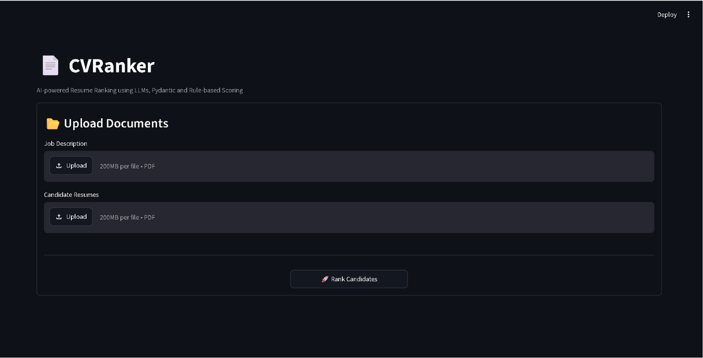
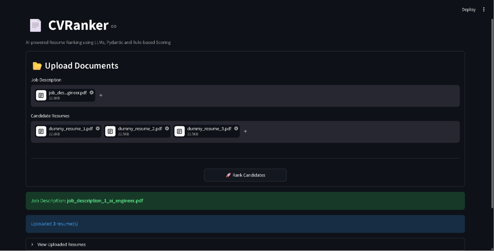
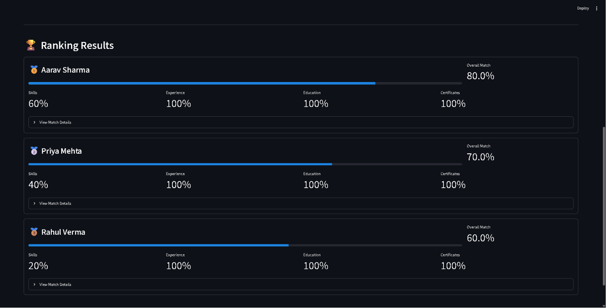
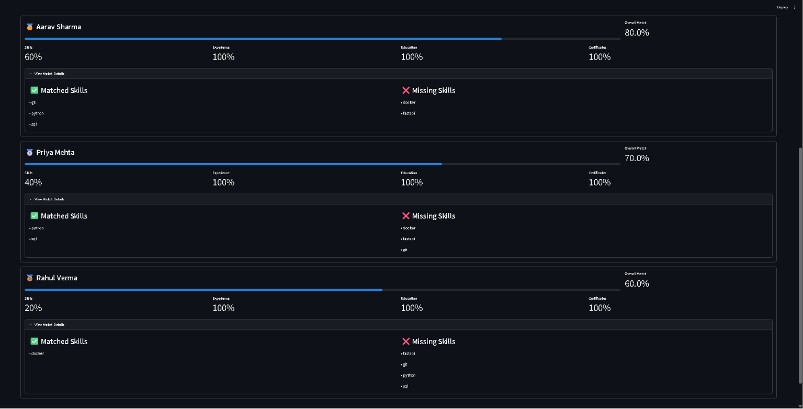

# 📄 CVRanker

An AI-powered resume ranking application that extracts structured information from resumes and job descriptions using Large Language Models (LLMs), validates the extracted data with Pydantic, scores candidates using a transparent rule-based engine, and ranks applicants based on their suitability for a role.

---

## Application Preview

### Home Screen



### Upload Screen



### Candidate Rankings



### Candidate Details



---

## Motivation

Recruiters often spend significant time manually reviewing resumes against job descriptions. CVRanker explores how Large Language Models can automate resume parsing while keeping the evaluation process transparent through structured validation and deterministic scoring.

This project was built to learn practical AI Engineering concepts including:

* LLM integration
* Structured data extraction
* Pydantic validation
* Modular software architecture
* Interactive AI applications with Streamlit

---

## Features

* 📄 Extract text from PDF resumes and job descriptions
* 🤖 AI-powered structured information extraction using Groq LLM
* ✅ JSON validation with Pydantic
* 🎯 Rule-based candidate scoring
* 🏆 Automatic ranking of multiple candidates
* 📊 Individual scores for:

  * Skills
  * Experience
  * Education
  * Certifications
* 📂 Upload multiple resumes simultaneously
* 💻 Interactive Streamlit dashboard

---

## Architecture

```
                Resume PDFs
                     │
                     ▼
          PyMuPDF Text Extraction
                     │
                     ▼
        Groq LLM Information Extraction
                     │
                     ▼
         Pydantic Schema Validation
                     │
                     ▼
      Resume & JobDescription Objects
                     │
                     ▼
          Rule-Based Scoring Engine
                     │
                     ▼
           Candidate Ranking Engine
                     │
                     ▼
             Streamlit Dashboard
```

---

## Project Structure

```text
CVRanker/
│
├── assets/
│   ├── home.png
|   ├── upload.png 
│   ├── ranking.png
│   └── details.png
│
├── data/
│   ├── jobs/
│   └── resume/
│
├── src/
│   ├── extractor.py
│   ├── parser.py
│   ├── prompts.py
│   ├── ranker.py
│   ├── schemas.py
│   └── scorer.py
│
├── streamlit_app.py
├── pyproject.toml
├── uv.lock
├── .env.example
└── README.md
```

---

## Tech Stack

| Category              | Technology                     |
| --------------------- | ------------------------------ |
| Language              | Python                         |
| LLM                   | Groq (Llama 3.3 70B Versatile) |
| PDF Processing        | PyMuPDF                        |
| Data Validation       | Pydantic                       |
| User Interface        | Streamlit                      |
| Dependency Management | uv                             |
| Environment Variables | python-dotenv                  |

---

## Installation

Clone the repository.

```bash
git clone https://github.com/KiRiTo5002/CVRanker.git
cd CVRanker
```

Install the project dependencies.

```bash
uv sync
```

Create a `.env` file in the project root.

```env
GROQ_API_KEY=your_groq_api_key
```

Run the application.

```bash
uv run streamlit run streamlit_app.py
```

The application will automatically open in your browser.

---

## Scoring Methodology

Candidates are evaluated using a weighted scoring system.

| Category       | Weight |
| -------------- | -----: |
| Skills         |    50% |
| Experience     |    25% |
| Education      |    15% |
| Certifications |    10% |

The application produces:

* Overall Match Score
* Skills Score
* Experience Score
* Education Score
* Certification Score
* Matched Required Skills
* Missing Required Skills

---

## Example Workflow

1. Upload a Job Description PDF.
2. Upload one or more Resume PDFs.
3. Click **Rank Candidates**.
4. The application:

   * extracts text from every PDF,
   * generates structured JSON using an LLM,
   * validates the extracted information,
   * scores every candidate,
   * ranks candidates from best to worst.
5. Review the ranked candidates through the interactive dashboard.


---

## License

This project is licensed under the MIT License.

---

## Author

**Pranjal Semalty**

If you found this project interesting, consider giving it a ⭐ on GitHub.
